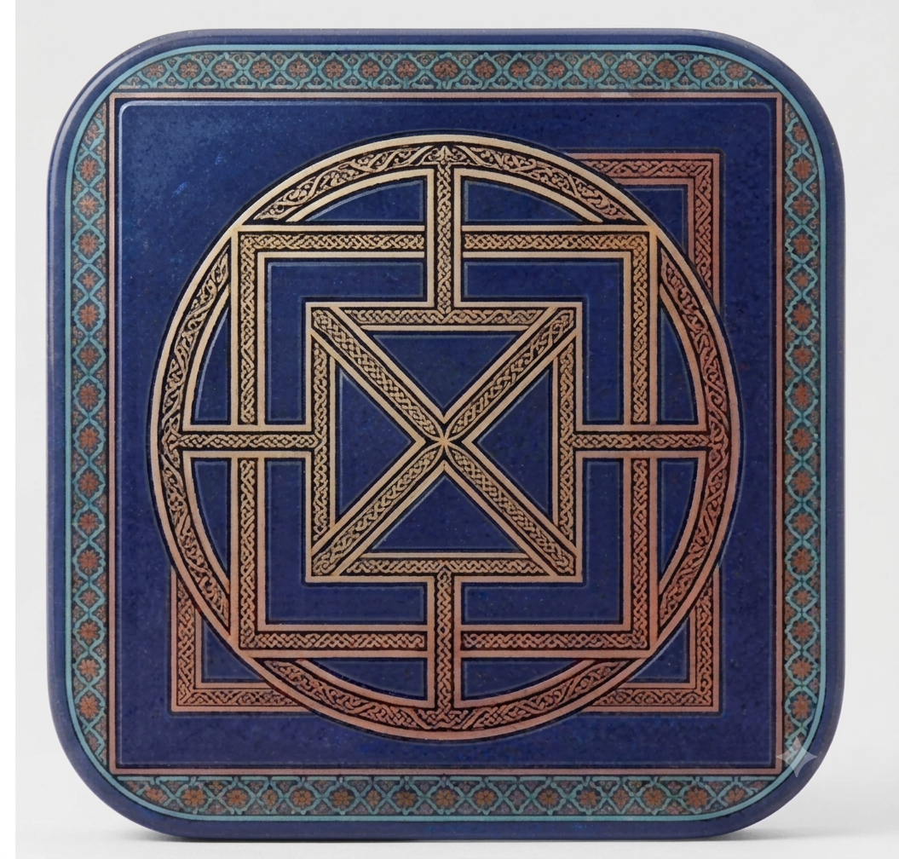

# Al-Qutim - Jogos do Gharb

  

## 📜 Sobre o Projeto
Esta aplicação mobile transporta para os ecrãs de smartphones e tablets o maior conjunto de jogos de tabuleiro da época islâmica encontrado em território português. Inspirada na coleção do Núcleo Museológico de Arqueologia de Alcoutim, a app permite que qualquer utilizador explore e jogue versões digitais destes passatempos milenares, unindo o património histórico à tecnologia moderna.

## 💡 Conceito e Simbologia:
* **Geometria Central:** O símbolo principal é uma fusão abstrata dos padrões geométricos encontrados nas lajes de xisto originais do **Moinho** (os quadrados concêntricos) e do **Alquerque** (as linhas diagonais e a estrutura circular), criando uma assinatura visual única para o projeto.
* **Paleta de Cores (Inspiração no Al-Andalus):**
    * *Azul-Índigo Profundo:* Associado à cerâmica de época e à envolvência do céu e do rio Guadiana.
    * *Ouro Envelhecido e Cobre:* Tons que remetem para os artefactos metálicos e moedas do período islâmico.
    * *Turquesa:* Um apontamento vibrante inspirado nos detalhes dos azulejos *zellige*.
* **Formato e Escalabilidade:** Enquadrado numa geometria de cantos arredondados (*squircle*), seguindo as diretrizes modernas de design de ícones (iOS/Android), o que garante uma excelente legibilidade e adaptação em ecrãs de *smartphones* e *tablets*.
* **Textura e Acabamento:** O fundo apresenta uma textura subtil que homenageia a rugosidade das lajes de xisto escavadas em Alcoutim, equilibrada com um acabamento digital polido e de alta definição para a *splash screen*.

## 🏰 Contexto Histórico
Os jogos que inspiram esta aplicação foram exumados durante as escavações no **Castelo Velho de Alcoutim**, uma fortificação islâmica ocupada entre os séculos VIII e XI. Originalmente gravados por incisão em lajes de xisto pelos habitantes locais, representam um testemunho fascinante de como o tempo livre era ocupado no Al-Andalus. 

## 🎲 Jogos Incluídos
A aplicação pretende recriar as seis tipologias de jogos identificadas nas escavações arqueológicas:

*   **Moinho (Trilha):** O clássico jogo de alinhamento e captura.
*   **Alquerque:** Jogo tático de estratégia militar, o antecessor direto do jogo das damas.
*   **Tapatan:** Uma versão antiga e estratégica do conhecido Jogo do Galo.
*   **Tábula:** O ancestral direto do gamão moderno.
*   **Mancala (Mancala III):** Jogo de semeadura e contagem matemática (exemplares únicos em Portugal).
*   **Soldado:** Tradicional jogo de percurso e estratégia.

---
*Projeto desenvolvido para preservar, valorizar e democratizar o acesso à história e arqueologia de Alcoutim através do formato digital.*